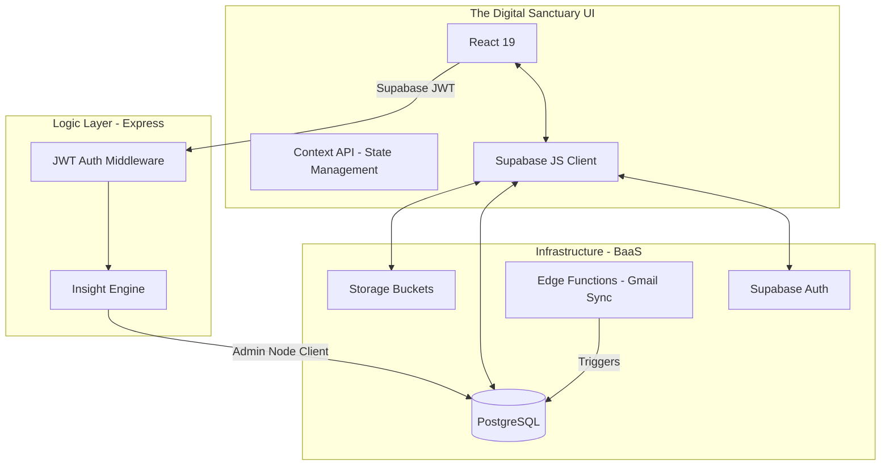

# 🌲 FlowState — Project Context & Engineering Manual

This document provides a comprehensive overview of the **FlowState** architecture, technical implementation, and development workflows. It serves as the primary source of truth for the project.

---

## 1-3. Project Overview, Goals, & Tech Stack

### Project Overview
**FlowState** is a high-fidelity productivity platform designed for "Deep Work." It bridges the gap between passive task tracking and active focus management by transforming the user's digital workspace into a "Digital Sanctuary."

### Core Goals
1.  **Context-Aware Productivity**: Use real behavior data to provide active coaching.
2.  **Atmospheric UI/UX**: Reduce cognitive load through high-fidelity visual design (Midnight Emerald/Quiet Architect).
3.  **Academic Organization**: Seamlessly manage tasks, focus sessions, and academic materials (folders/subjects).
4.  **Automation Intelligence**: Automate task ingestion from Gmail and rule-based prioritization.

### Tech Stack
| Layer | Technologies |
| :--- | :--- |
| **Frontend** | React 19 (Vite), Context API, Chart.js, Lucide Icons, Vanilla CSS |
| **Backend** | Node.js, Express, Supabase JWT Auth Middleware |
| **Database** | PostgreSQL (Supabase) |
| **Auth** | Supabase Auth (JWT-based) |
| **Storage** | Supabase Storage (`subject-files` bucket) |
| **Automation** | Supabase Edge Functions (Deno) |

---

## 4-5. Architecture & Folder Structure

### High-Level Architecture
FlowState follows a hybrid client-server-BaaS architecture.



### Folder Structure
```text
FlowState/
├── backend/            # Express API (Insight Engine, Custom Logic)
│   ├── controllers/    # Route handlers
│   ├── middlewares/    # Auth, Error handling
│   ├── routes/         # API Endpoint definitions
│   ├── services/       # Core business logic (InsightEngine.js)
│   └── utils/          # Supabase & Helper utilities
├── frontend/           # React 19 / Vite UI
│   ├── src/
│   │   ├── components/ # Reusable UI Modules (Topbar, Sidebar)
│   │   ├── context/    # Global State (Auth, Task, Theme)
│   │   ├── pages/      # View Layers (Dashboard, Folders)
│   │   └── services/   # API & Supabase Client initialization
├── supabase/           # Infrastructure Code
│   ├── functions/      # Edge Functions (Gmail/Auth logic)
│   └── migrations/     # SQL Schema, RLS, and Triggers
└── config/             # Shared Configuration (Env wrapper)
```

---

## 6-7. Env Vars & Supabase Config

### Environment Variables
Required `.env` keys (root/frontend/backend):
- `VITE_SUPABASE_URL`: Supabase Project URL.
- `VITE_SUPABASE_ANON_KEY`: Client-side safe key.
- `SUPABASE_SERVICE_ROLE_KEY`: Backend admin-level key (Never expose to client).
- `JWT_SECRET`: Secret for any custom Node-level tokens (Supabase handles main auth).

### Supabase Strategy
FlowState uses a **Two-Client Strategy**:
1.  **Frontend Client**: Initialized with `anon` key. Enforces **Row Level Security (RLS)** based on `auth.uid()`.
2.  **Backend/MCP Client**: Initialized with `service_role` key. Bypasses RLS to perform analytical aggregations or system-level updates triggered by user actions.

---

## 8. Full Database Schema

### Core Tables

#### `public.users` (Profile Sync)
- `id` (UUID, PK): References `auth.users(id)`.
- `email` (TEXT): Mirrored from auth.
- `full_name` (TEXT).
- `avatar_url` (TEXT).

#### `public.tasks` (Activity Hub)
- `id` (UUID, PK).
- `user_id` (UUID): References `auth.users(id)`.
- `name` (TEXT).
- `category` (ENUM): 'Work', 'Study', 'Personal', etc.
- `priority` (ENUM): 'low', 'medium', 'high', 'urgent'.
- `status` (ENUM): 'todo', 'in-progress', 'completed'.

#### `public.focus_sessions` (Bio-Feedback Data)
- `id` (UUID, PK).
- `user_id` (UUID).
- `task_id` (UUID, Nullable).
- `duration` (INT): In seconds.

#### `public.subject_folders` & `public.subject_materials` (Academic Library)
- **Folders**: `id`, `user_id`, `name`, `code`, `semester`.
- **Materials**: `id`, `subject_id`, `title`, `file_url`, `source` ('upload', 'gmail').

### RLS Policies
- **Strict User Isolation**: Every table features `auth.uid() = user_id` checks.
- **Select/Insert/Update/Delete**: Explicitly granted to `authenticated` role.

---

## 9. Complete Auth System

### Flow
1.  **Sign Up/In**: Handled via Supabase Auth (Email/Google).
2.  **Profile Sync**: A DB trigger (`public.handle_new_user`) automatically creates a `public.users` record on signup.
3.  **Token Management**: Client receives a JWT; subsequent requests to the Express backend include the `Authorization: Bearer <token>` header.
4.  **Backend Verification**: Express middleware (`backend/middlewares/auth.js`) validates the Supabase JWT to extract the `userId`.

### Gmail Logic (Phase 6)
- **Trigger**: Periodic sync or webhook calls the `sync-gmail` Edge Function.
- **Parsing**: Metadata (Sender, Subject) is extracted and mapped to `inbox_items`.
- **User Rules**: If a user has a rule for "Boss" -> "Urgent", the system automatically tags the ingested item.

---

## 10. API Endpoints

| Method | Path | Auth | Logic |
| :--- | :--- | :--- | :--- |
| `GET` | `/api/health` | Public | System status heartbeat. |
| `GET` | `/api/insights` | JWT (Required) | Aggregates focus sessions to produce coaching metrics. |
| `POST` | `/api/sync/gmail` | JWT (Required) | Triggers Gmail ingestion for the authenticated user. |

### API Guidance
- All responses use standard JSON format.
- Errors include `success: false` and a `message`.
- Rate Limit: Currently handled via standard server-side limits (60 req/min recommended).

---

## 11-12. Request/Response Format & /me

### Standard Response
```json
{
  "success": true,
  "data": { ... },
  "message": "Optional feedback"
}
```

### Enhanced Profile (`/me` equivalent)
Supabase `auth.getUser()` provides the primary object, supplemented by frontend `AuthContext` which fetches:
```json
{
  "user": {
    "id": "uuid",
    "email": "user@example.com",
    "profile": {
      "full_name": "Saksham",
      "institution": "University XYZ",
      "semester": 4
    }
  }
}
```

---

## 13. Security Measures
1.  **Helmet.js**: Sets security headers.
2.  **CORS**: Strict origin checking for the production client URL.
3.  **DB Row Level Security**: Native Postgres firewall for every row.
4.  **Service Role Isolation**: Backend-only keys never reach the browser.
5.  **Environment Variable Encryption**: Secrets managed via secure platform vars.
6.  **Input sanitization**: Express built-in JSON parsing limits.
7.  **JWT Scoped Validation**: Backend only trusts signatures from the Supabase Project.
8.  **Cookie Security**: `httpOnly` and `secure` flags for session cookies.
9.  **RLS Triggers**: Automated metadata updates in the DB layer.
10. **Storage Policies**: Signed URL generation for private subject files.

---

## 14-15. Coding Conventions & Validation

### Conventions
- **Naming**: `camelCase` for variables, `PascalCase` for Components, `snake_case` for DB columns.
- **Modular Components**: Every complex page is broken into smaller function-based modules.
- **Context Pattern**: All API-driven data (Tasks, Inboxes) is housed in Context Providers for reactive UI updates.

### Validation (Logical Schemas)
While `zod` is not currently as a project-level dependency, the following logical schema is enforced:
```javascript
const TaskSchema = {
  name: "string (required, min 3)",
  priority: "enum ['low', 'medium', 'high', 'urgent']",
  status: "enum ['todo', 'in-progress', 'completed']",
  category: "enum ['Work', 'Study', 'Personal', 'Health', 'Finance']"
};
```

---

## 16-17. Features Checklist & Future Scope

### Completed (Phase 1-7)
- [x] Atmospheric Theme System (Emerald/Architect).
- [x] Task & Inbox Management.
- [x] High-Intent Focus Mode (The Cave).
- [x] Subject Folder Library with file uploads.
- [x] AI Coaching Engine (Insights API).
- [x] Advanced Topbar & Sidebar Navigation.

### Pending Phase 2
- [ ] **Predictive Scheduling**: AI-driven task blocking based on peak focus hours.
- [ ] **Semantic Search**: Searching across uploaded academic notes using embeddings.
- [ ] **Collaborative Sanctuaries**: Shared folders for group study.

---

## 18. How to Run & Quick Test

### Local Development
1.  **Backend**: `npm run server:dev` (runs at `http://localhost:3000`).
2.  **Frontend**: `npm run client` (runs at `http://localhost:5173`).

### Quick Test
- **Health Check**: `curl http://localhost:3000/api/health`
- **Insights Test**: Ensure logged in, then hit `GET http://localhost:3000/api/insights` with bearer token.

---

## 19. File-by-File Summary (Key Exports)

| File | Key Exports / Role |
| :--- | :--- |
| `backend/server.js` | Main entry point, middleware assembly, production static serving. |
| `backend/services/insightEngine.js` | `generateInsightPayload`: logic for focus session analysis. |
| `frontend/src/context/AuthContext.jsx` | `useAuth`: Singleton provider for user session and profile data. |
| `supabase/migrations/*` | Pure SQL definitions for the entire application state. |
| `config/index.js` | Unified configuration object for local/production environments. |
